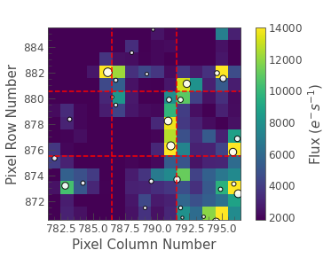

# TPFstitch

By inputting the FITs files of between 2-9 K2 target pixel files (TPFs) which share a border, TPFstitch produces a single FITs file containing the stitched TPFs, which we call the TPF patch. This product name was chosen by envisening the sky as a quilt. TPFstitch is the needle that sews the patches together into a patchwork quilt.

The world coordinate system is maintained within the final product, i.e. the RAs and DECs of targets can be identified in the resultant TPF patch. Additionally, the patch FITs file can be read straight into asteroseismic data analysis tools, such as LightKurve. 

Currently, TPFstitch is only designed for the M9 and M19 clusters, but it could be easily adapted for any K2 object with several TPFs; e.g. other clusters, asteroids/comets, microlensing events, galaxies, etc. There is also the potential for TPFstitch to be applied to other photometric surveys, such as TESS.

An example patch for M9 from TPFstitch is provided below. The red lines divide the patch into the 9 individual TPFs (EPIC 200145500-200145502, 200145512-200145514, \& 200145488-200145490). The centre of the stars contained in the field are illustrated by the white circles, where the larger circles indicate stars with brighter magnitudes.

You can reproduce this superstamp using the following:

```
TS.TPFstitch(200145501, K2_object = 'M9', download_MAST = False, file_name = 'Star.fits')
```

<div align="center">



